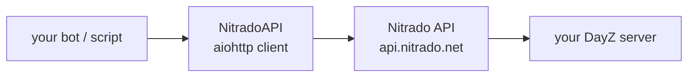

<div align="right">

[](https://www.python.org/)
[](https://docs.aiohttp.org/)
[](LICENCE)

</div>

# nitrado_api_lib

### Async Python client for the Nitrado game-server API — DayZ-oriented. Restart servers, manage whitelists, push configs, and schedule restarts without touching the web panel.

> Originally authored by **DonMatraca** ([original repo](https://github.com/DonMatraca/nitrado_api)) · v0.2 · MIT

---

## Features

- 🖥️ Retrieve server details
- 🔁 Restart and stop the server
- 👥 Manage player lists — whitelist, banlist, priority list
- 📁 Handle config files: upload, download, validate
- ⏰ Schedule automatic restarts
- 🧩 Async-first and extensible — built on `aiohttp`



---

## Quick start

```bash
pip install git+https://github.com/toxicwind/nitrado_api_lib.git
```

```python
import asyncio
from nitrado_api import NitradoAPI

async def main():
    api = NitradoAPI("YOUR_NITRADO_TOKEN")          # token from env — never hardcoded

    details = await api.get_server_details(nitrado_id="123456")
    print("Server details:", details)

    await api.restart_server(nitrado_id="123456")   # restart the server

    await api.manage_list("123456", action="add",    # whitelist two players
                          list_type="whitelist",
                          members=["User1", "User2"])

asyncio.run(main())
```

---

## API reference

`NitradoAPI(nitrado_token)` — initializes the client with your Nitrado API token.

| Method | What it does |
|---|---|
| `get_server_details(nitrado_id)` | Retrieve details for the specified server |
| `restart_server(nitrado_id)` | Restart the server |
| `stop_server(nitrado_id)` | Stop the server |
| `manage_list(nitrado_id, action, list_type, members)` | Add/remove players on the whitelist, banlist, or priority list |

---

## Config

| Knob | Source |
|---|---|
| Nitrado API token | pass to `NitradoAPI(...)` — load from an environment variable or secrets manager, never commit it |

Requirements: Python 3.6+, `aiohttp` (see `requirements.txt`).

---

## Dev / contributing

This is early-stage and lots of things can still fail — contributions are welcome. Open an issue or PR on [GitHub](https://github.com/toxicwind/nitrado_api_lib), or reach the original author on Discord as `DonMatraca#2756`.

---

## License & security

**MIT** — see [LICENCE](LICENCE).

Your Nitrado token controls your servers: keep it in the environment, rotate it if it ever touches a log or a commit, and never paste it into issues.
